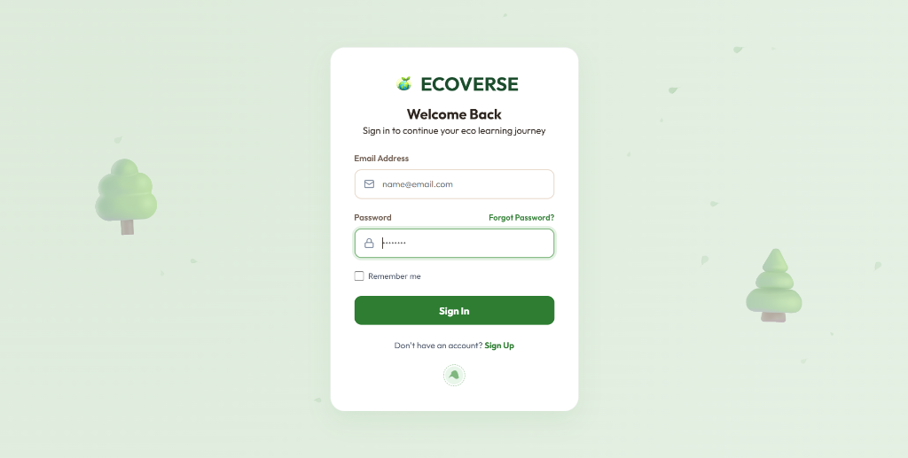
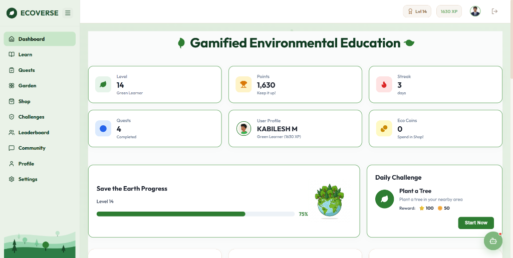
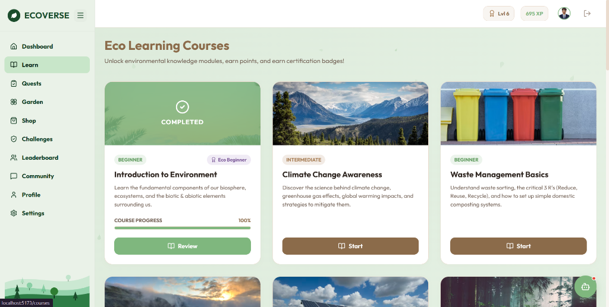
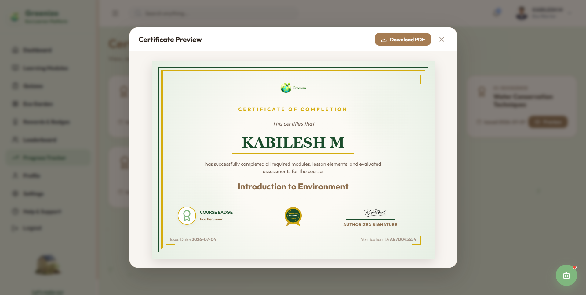

# 🌱 Ecoverse: Gamified Environmental Education Platform 🌍

A feature-rich, full-stack application designed to educate, engage, and empower individuals to adopt sustainable habits through interactive learning and virtual gardening.🌍 Together, we're building a smarter and more sustainable future through technology.

---

## 📖 Overview
Ecoverse is a gamified environmental education web platform that bridges the gap between learning about sustainability and taking real-world action. Users earn Eco Points by completing interactive courses and passing knowledge quizzes. These points can be spent in the Reward Shop to buy virtual plants, seeds, and decorations for their personalized Eco-Garden. The platform also features weekly environmental missions to encourage real-life eco-friendly habits, a global leaderboard to compete with friends, community forums to share ideas, and downloadable verified certificates.

---

## 🚀 Live Demo
🔗 https://greenizo-delta.vercel.app/

---


## 🚀 Key Features

### 🔐 1. Authentication & Security
* **Secure Access:** User registration, login, and JWT-based authentication.
* **OTP Verification:** Secure verification during sign-up and password reset via emails.
* **Role-Based Control:** Admin dashboard access restricted to administrator accounts.

### 🎓 2. Interactive Learning Modules
* **Eco-Courses:** Informative, structured courses covering climate action, renewable energy, waste management, and more.
* **Knowledge Checks:** Interactive quizzes at the end of each lesson to lock in knowledge.
* **XP & Eco-Points:** Earn rewards for every correct quiz answer and lesson completed.

### 🏆 3. Verified Eco-Certificates
* **Earn Certifications:** Get awarded formal certificates upon successful completion of courses.
* **Downloadable PDF:** Instantly generate and download PDF certificates locally using HTML Canvas.

### 🏡 4. Personalized Eco-Garden
* **Virtual Ecosystem:** Grow a digital tree that matures as you earn XP.
* **Customize & Decorate:** Place, move, and design your digital garden with items purchased from the shop.

### 🛒 5. Reward Shop
* **Spend Eco-Points:** Buy seeds, plants, solar panels, compost bins, and other decorative assets.
* **Gamified Progression:** Unlock premium items as your Eco-level increases.

### 📅 6. Weekly Missions & Challenges
* **Real-world Impact:** Participate in off-screen missions like "Plant a Sapling," "Zero Waste Day," or "Meat-free Monday."
* **Proof Uploads:** Upload progress/proof to complete tasks and claim premium rewards.

### 📊 7. Leaderboards & Community
* **Eco-Warrior Standings:** Compete globally on the XP leaderboard.
* **Community Forums:** Share sustainability tips, post pictures of your real-life garden, and discuss ideas.

### 🤖 8. AI Eco-Assistant
* **Interactive Chat:** Ask the virtual environmental assistant questions about ecology, climate science, or recycling tips.

### 🛡️ 9. Admin Control Panel
* **Complete Management:** Modify courses, lessons, quizzes, weekly missions, and shop items directly from the UI.
* **Auditing:** Monitor user activity and system stats.

---

## 🛠️ Technology Stack

### 💻 Frontend (Client)
* **Framework:** React 19
* **Build Tool:** Vite
* **Styling:** Custom Modern Vanilla CSS (Sleek card designs, glassmorphism, responsive grids)
* **Animations:** Framer Motion
* **Icons:** Lucide React
* **PDF Generation:** `jspdf` & `html2canvas`
* **HTTP Client:** Axios

### ⚙️ Backend (Server)
* **Framework:** Spring Boot 3.5.16 (Java 17)
* **Security:** Spring Security (JWT-based token validation)
* **Data Access:** Spring Data JPA / Hibernate
* **Database:** MySQL 8.x
* **Mailing:** Spring Boot Starter Mail (OTP and Password Reset)

---

## 📸 Screenshots

*Actual screenshots from the deployed Ecoverse application:*

### 1. Login Page

*Provides secure credential entry with animated visual assets.*

### 2. Dashboard

*A consolidated display showing level status, streak count, points, and weekly missions.*

### 3. Course Page

*Interactive learning modules featuring topic-based chapters and quizzes.*

### 4. Certificate

*Custom generated PDF certificate showing completion signatures and course metadata.*

---

## 📁 Directory Structure

```text
Ecoversee/
├── backend/                  # Spring Boot Maven Project
│   ├── src/main/java/        # Java Source Files
│   │   └── com/ecoverse/demo/
│   │       ├── controller/   # REST Controllers (API Endpoints)
│   │       ├── dto/          # Data Transfer Objects
│   │       ├── entity/       # JPA Entities / Database Schema
│   │       ├── repository/   # JPA Repositories
│   │       ├── security/     # JWT & Spring Security Configuration
│   │       ├── service/      # Business Logic Services
│   │       └── util/         # Utility Helper Classes
│   ├── src/main/resources/   # Application properties & assets
│   └── pom.xml               # Maven configuration & dependencies
│
├── frontend/                 # React Vite Project
│   ├── src/
│   │   ├── components/       # Reusable React components (Sidebar, Navbar, AI Assistant)
│   │   ├── context/          # Auth context and states
│   │   ├── pages/            # Application views (Dashboard, Garden, Shop, Leaderboards)
│   │   ├── App.jsx           # Main routing & application layout
│   │   ├── index.css         # Styling system & global styles
│   │   └── main.jsx          # Entry point
│   ├── package.json          # Frontend packages & dev scripts
│   └── vite.config.js        # Vite configurations
│
└── run_project.bat           # Quick launcher script (Windows)
```

*Let's build a greener future together!* 🌲🌻🌞
