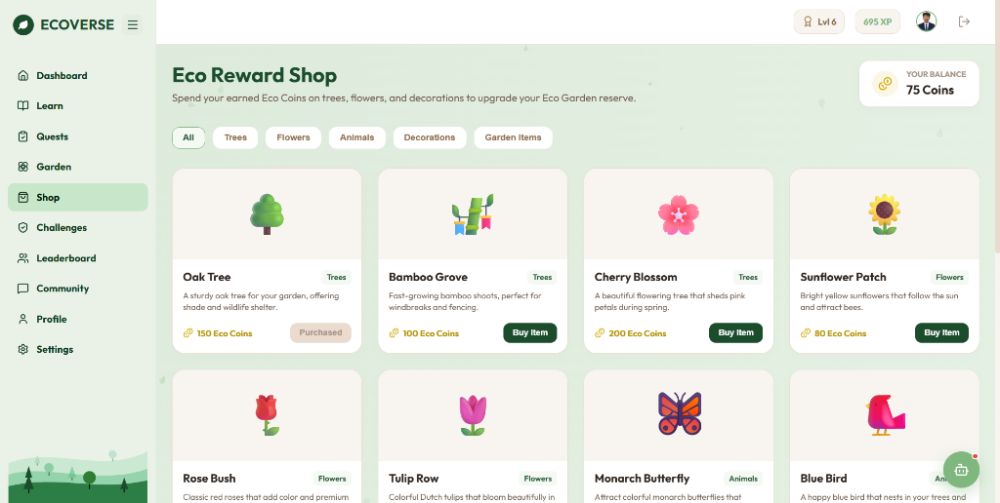

# 🌱 Ecoversee – Gamified Environmental Education Platform

## 📖 Overview

**Ecoversee** is a comprehensive, full-stack gamified web application designed to foster environmental awareness and promote sustainable lifestyle habits. Developed using React for a modern frontend interface, Spring Boot for a robust and secure backend service, and MySQL for relational data persistence, the platform bridges the gap between theoretical environmental education and real-world ecological actions.

By combining gamification mechanics—such as interactive courses, knowledge quizzes, virtual tree cultivation, and collectible badges—with practical weekly challenges and community engagement forums, Ecoversee motivates users to learn about climate change, resource management, and biodiversity. The system includes downloadable verified certificates, a virtual rewards shop, and a administrative dashboard for course management, making it an engaging educational toolkit.

---

## 🚀 Key Features

* **🔐 User Authentication:** Secure register, login, and JWT-based session management, completed with email-based OTP verification for account setup and password recovery.
* **🎓 Interactive Environmental Courses:** Educational course modules covering solar energy, recycling, water conservation, and biodiversity.
* **📝 Quizzes with XP & Eco Points:** Interactive knowledge checks at the end of each module. Answering questions correctly rewards users with Experience Points (XP) and Eco Coins.
* **🏆 Badge & Achievement System:** Collectible digital achievements and milestones unlocked as users level up and complete green tasks.
* **🌳 Virtual Tree Growth:** A personalized digital tree that grows interactively in 3D (with 360° controls) as users gain overall XP on the platform.
* **🏡 Eco Garden Customization:** A customizable personal digital reserve where users can place flowers, ponds, compost bins, and wildlife.
* **🛒 Reward Shop:** A virtual store where users can spend their earned Eco Coins to buy new digital plants and garden accessories.
* **📅 Weekly Challenges:** Practical real-world challenges (e.g. Tree Plantation Drive, Plastic-Free Week) with image upload proof verification and a 24-hour rate limit lock.
* **📊 Leaderboard:** A global ranking system displaying the standings of all Eco-Warriors based on their total earned XP.
* **💬 Community Forum:** A social space for users to share ecological tips, post pictures of real-life green actions, and discuss environmental ideas.
* **🤖 AI Eco Assistant:** An interactive, AI-powered chat helper capable of answering environmental and sustainability questions in real-time.
* **📄 Downloadable Certificates:** Verified course completion certificates dynamically generated on the client side using HTML Canvas and downloadable as PDFs.
* **🛡️ Admin Dashboard:** A course management console for administrators and staff to add, edit, or delete courses, manage quizzes, audit user logs, and track weekly mission statuses.

---

## ⚙ Project Setup

### Prerequisites
Make sure you have the following installed on your system:
* **Java Development Kit (JDK) 17+**
* **Node.js (v18+) & npm**
* **MySQL Community Server**
* **Git**

---

### Backend Setup
1. Open your MySQL client and create a database named `gamified_environmental_education`:
   ```sql
   CREATE DATABASE gamified_environmental_education;
   ```
2. Navigate to `backend/src/main/resources/application.properties` and update the database credentials to match your local setup:
   ```properties
   spring.datasource.url=jdbc:mysql://localhost:3306/gamified_environmental_education?createDatabaseIfNotExist=true&useSSL=false&allowPublicKeyRetrieval=true&serverTimezone=UTC
   spring.datasource.username=YOUR_MYSQL_USERNAME
   spring.datasource.password=YOUR_MYSQL_PASSWORD
   ```
3. Update your Gmail SMTP properties for OTP delivery:
   ```properties
   spring.mail.username=your_email@gmail.com
   spring.mail.password=your_app_password
   ```
4. Run the Spring Boot application from the backend directory:
   ```bash
   cd backend
   # Windows:
   mvnw.cmd spring-boot:run
   # macOS/Linux:
   ./mvnw spring-boot:run
   ```
The backend server runs on `http://localhost:8080`.

---

### Frontend Setup
1. Navigate to the frontend directory:
   ```bash
   cd frontend
   ```
2. Install the package dependencies:
   ```bash
   npm install
   ```
3. Start the Vite React development server:
   ```bash
   npm run dev
   ```
The frontend dev server runs on `http://localhost:5173`.

---

### Run Using Batch File
For convenience on Windows machines, you can automate starting both servers by double-clicking the `run_project.bat` file located in the project root. This launcher automatically manages port checks, compiles resources, and opens the application in your default web browser.

---

## 📁 Project Structure

```text
Ecoversee/
├── backend/                  # Spring Boot backend source files & Maven setup
├── frontend/                 # React frontend source files, styles, & assets
├── README.md                 # Project documentation & configuration guide
└── run_project.bat           # Automated launch utility script (Windows)
```

---

## 📸 Screenshots

*Actual screenshots from the deployed Ecoversee application:*

### 1. Login Page

*Provides secure credential entry with animated visual assets.*

### 2. Dashboard

*A consolidated display showing level status, streak count, points, and weekly missions.*

### 3. Course Page

*Interactive learning modules featuring topic-based chapters and quizzes.*

### 4. Virtual Tree

*Shows tree development in 3D rotation, with water, fertilize, and sunlight trivia actions.*

### 5. Reward Shop

*Virtual items purchase area for buying seeds, decorations, and garden assets.*

### 6. Weekly Challenges

*Real-world logging section featuring image verification upload panels and ticking locks.*

### 7. Community Forum

*A platform to publish posts, upload images, comment on sustainability discussions, and interact.*

### 8. Leaderboard

*User rank listings displaying top performers based on experience point accumulations.*

### 9. Certificate

*Custom generated PDF certificate showing completion signatures and course metadata.*

### 10. Admin Dashboard

*Administrative controls allowing course and quiz modifications via interactive step wizards.*

---

## 🎯 Future Enhancements

* 📱 **Mobile Application:** Porting the platform to React Native for native Android and iOS compatibility.
* 🤖 **AI-Powered Personalized Learning:** Automatically recommending customized course pathways based on quiz performance and user history.
* 🔔 **Real-Time Push Notifications:** Instant updates for community forum comments, leaderboard shifts, and new seasonal challenges.
* 🔑 **Social OAuth Integration:** Sign-in support using Google, GitHub, and Facebook for seamless user onboarding.
* ⚔️ **Multiplayer Environmental Events:** Co-operative events where teams of users complete combined goals (e.g. planting 1000 virtual trees together).

---

## 👨‍💻 Developer

* **Name:** Kabilesh M
* **Register Number:** 922524205066
* **Project:** Ecoversee – Gamified Environmental Education Platform
* **Frontend:** React + Vite
* **Backend:** Spring Boot
* **Database:** MySQL
